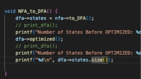
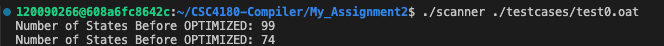

# CSC4180 Assignment 2 Report
## Name: Yutong Feng ID: 120090266
- Excution
    - Compile the source code with the command "make all"
    - Example: test0.oat
    ```
    # Flex Scanner
    ./lexer < ./testcases/test0.oat
    # Handwritten Scanner
    ./scanner ./testcases/test0.oat
    ```
    - You can also use "verify_compiler.sh" for multiple testcases. It will compare results of flex scanner with handwritten scanner.

- Design and Implementation
    - Lex Scanner can recognize tokens of Oat expressed as RegEx, such as *[a-zA-Z][a-zA-Z][a-zA-Z0-9_]* for ID and *[0-9]+* for INTLITERAL. *yytext* is used to display the original text.
    - Handwritten Scanner;
        - First construct NFA of each token given its RegEx format and mark the end of token. Then union all the NFAs together to get a NFA with one unique start and one unique end. Help functions such as `set_union` and `kleene_star` need to be implemented.
        - Convert the NFA to DFA. This is done by Subset Constrution. Data structures such as `std::map<std::set<State*>, DFA::State* > mark` to map the relationship between NFA closure and DFA state are needed. DFA's end state is determined by the state with highest precedence in the closure
        - (Bonus) Minimize DFA. Some DFA states are equivalent and can be merged. If two states transite from the same character can reach the same state, for any character, then the two states can be seen as equivalent. Repeatedly merge states until there's no new merged states. 
        - Scan File using minimized DFA. Ideas see *Recognize Longest Match*

- Choice of Regular Expressions for Lexical Specification:
    Regular expressions are chosen for lexical specification because they provide a concise way to describe patterns within strings. This is useful in a scanner as it needs to recognize different tokens like identifiers and operators, each of which can be neatly described using regular expressions.
- Suitability of NFA over DFA:
    NFA is more suitable for representing regular expressions due to its flexibility and simpler construction, **especially when dealing with alternation (OR operations) and closures (Kleene star)**. NFAs allow for **parallel edges for the same input symbol**, making it easier to handle expressions that can take multiple paths simultaneously.
- Recognize Longest Match
    The scanner follows the rule to match the longest. This is done by continuely jumping to next state if there exits matched state. Otherwise, we match from the start of DFA. For resolving conflicts where multiple patterns match the same string, precedence based on the order of token specifications, giving priority to certain tokens over others.
- Necessity of NFA to DFA Conversion:
    DFA is used for the actual scanning process due to its deterministic nature, which leads to more efficient token recognition without backtracking. The conversion from NFA to DFA ensures that for each piece of input, **there is exactly one possible transition at any given time.** This makes the scanning process faster and simplifies the implementation of the scanner.

- Bonus
    - Lex Scanner will also print the error message if it encounters an error and gives the location of error by using `yylineno`.
    - Minimized DFA for higher efficiency. It reduce 99 nodes to 74 nodes.

    
    

    - By adding an `except` parameter to `from_any_char` we can implement string as `"(.^")"`. We ignore `except` when building transition.
    - A `verify_compiler.sh` is implemented to compare multitests. 