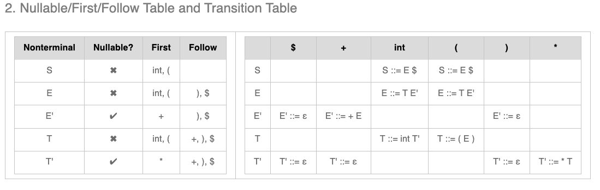

# CSC4180 Assignment3 Report
### Id: 120090266 Name: Yutong Feng
### Q1: Resolve Ambiguity for Micro Language’s Grammar

#### 1. Counter-Example for Ambiguity
Example: `ID PLUOP ID MINUSOP ID` could be parsed in at least two different ways. The first way is to parse it as `(ID PLUOP ID) MINUSOP ID`, and the second way is to parse it as `ID PLUOP (ID MINUSOP ID)`.

#### 2. LL(1) Parsing Table Ambiguity Clarification
- **(a)** **Yes**. This is because LL(1) grammars require a single production rule to be applicable for any given non-terminal and input symbol combination. Multiple entries for the same combination suggest that the parser has more than one way to proceed, which may lead to ambiguity.

- **(b)** **No**. Ambiguity could arise in situations not covered by the table, especially in grammars that are not strictly LL(1) or involve more complex constructs not captured by the table. (?)

### Q2  Simple LL(1) and LR(0) Parsing Exercises

#### LL(1) Grammar Modification
- **1. Modify the Grammar**: To make the given grammar LL(1), we need to eliminate left recursion and apply left factoring where necessary. Refactored grammar (expressed by the format from Princeton web demo):

    ```
    E ::= T E'
    E' ::= + E 
    T ::= int T' 
    T ::= ( E )
    T' ::= * T 
    E' ::= ''
    T' ::= ''
    ```
- **2. Translation table for LL(1) Demo**: 
  

- **3. Parse Tree**: 
  


#### LR(0) Grammar Exploration
- **1. Default LR(0) Grammar**: The exploration of the default LR(0) grammar using the web demo will involve understanding the LR(0) automaton, including its table and DFA diagram.

- **2. LL(1) and LR(0) Compatibility**
  - The demo of default LR(0) grammar will show that it is not LL(1) compatible.
  - The demo of default LL(1) grammar will show that it is not LR(1) compatible.
  - Why LL(1) demo is not LR(0): Potential Shift-Reduce Conflict
  
    The conflict most likely occurs with the handling of the + and * operators, which are part of E' and T' respectively. 

    For example, conflict at + in E':

    When the parser encounters + after processing an id (for example, in the input id +), it faces a decision:
    Shift: considering more input could lead to recognizing a longer pattern like + T E'.
    Reduce: based on T ::= F T' and F ::= id, the parser could decide to reduce the already read id to F, then T, and potentially start reducing E ::= T E'.
    However, without lookahead (as in LR(0)), the parser cannot decide based solely on the current state and the + symbol whether to shift or reduce.

### Q3: Implement LL(1) Parser by hand for Oat v.1
  - Compile:
    ```
    g++ main.cpp -o main -std=c++11
    ```
  - Excute:
    ```
    ./main ${rule_file}$ ${lexer_file}$ 
    ``` 
  - Example: test0-tokens.txt
    ```
    ./main input.txt test0-tokens.txt
    ``` 

    The program will print the steps similar to web demo
    ```
    Stack top: S, begining of remaining input: int
    Step 1: Reduce by S -> prog $ 
    Stack top: prog, begining of remaining input: int
    Step 2: Reduce by prog -> decl prog 
    Stack top: decl, begining of remaining input: int
    Step 3: Reduce by decl -> fdecl 
    Stack top: fdecl, begining of remaining input: int
    Step 4: Reduce by fdecl -> t id ( args ) block 
    Stack top: t, begining of remaining input: int
    Step 5: Reduce by t -> primary_t t_arr 
    Stack top: primary_t, begining of remaining input: int
    Step 6: Reduce by primary_t -> int 
    Stack top: int, begining of remaining input: int
    Step 7: Match int with int
    Stack top: t_arr, begining of remaining input: id
    Step 8: Reduce by t_arr -> empty
    Stack top: id, begining of remaining input: id
    Step 9: Match id with id
    Stack top: (, begining of remaining input: (
    Step 10: Match ( with (
    Stack top: args, begining of remaining input: )
    Step 11: Reduce by args -> empty
    Stack top: ), begining of remaining input: )
    Step 12: Match ) with )
    Stack top: block, begining of remaining input: {
    Step 13: Reduce by block -> { stmts } 
    Stack top: {, begining of remaining input: {
    Step 14: Match { with {
    Stack top: stmts, begining of remaining input: var
    Step 15: Reduce by stmts -> stmt stmts 
    Stack top: stmt, begining of remaining input: var
    Step 16: Reduce by stmt -> vdecl ; 
    Stack top: vdecl, begining of remaining input: var
    Step 17: Reduce by vdecl -> var id = exp 
    Stack top: var, begining of remaining input: var
    Step 18: Match var with var
    Stack top: id, begining of remaining input: id
    Step 19: Match id with id
    Stack top: =, begining of remaining input: =
    Step 20: Match = with =
    Stack top: exp, begining of remaining input: stringliteral
    Step 21: Reduce by exp -> term exp' 
    Stack top: term, begining of remaining input: stringliteral
    Step 22: Reduce by term -> primary 
    Stack top: primary, begining of remaining input: stringliteral
    Step 23: Reduce by primary -> stringliteral 
    Stack top: stringliteral, begining of remaining input: stringliteral
    Step 24: Match stringliteral with stringliteral
    Stack top: exp', begining of remaining input: ;
    Step 25: Reduce by exp' -> empty
    Stack top: ;, begining of remaining input: ;
    Step 26: Match ; with ;
    Stack top: stmts, begining of remaining input: id
    Step 27: Reduce by stmts -> stmt stmts 
    Stack top: stmt, begining of remaining input: id
    Step 28: Reduce by stmt -> id stmt' 
    Stack top: id, begining of remaining input: id
    Step 29: Match id with id
    Stack top: stmt', begining of remaining input: (
    Step 30: Reduce by stmt' -> func_call arr_idx assign ; 
    Stack top: func_call, begining of remaining input: (
    Step 31: Reduce by func_call -> ( exps ) 
    Stack top: (, begining of remaining input: (
    Step 32: Match ( with (
    Stack top: exps, begining of remaining input: id
    Step 33: Reduce by exps -> exp exps' 
    Stack top: exp, begining of remaining input: id
    Step 34: Reduce by exp -> term exp' 
    Stack top: term, begining of remaining input: id
    Step 35: Reduce by term -> primary 
    Stack top: primary, begining of remaining input: id
    Step 36: Reduce by primary -> id func_call arr_idx 
    Stack top: id, begining of remaining input: id
    Step 37: Match id with id
    Stack top: func_call, begining of remaining input: )
    Step 38: Reduce by func_call -> empty
    Stack top: arr_idx, begining of remaining input: )
    Step 39: Reduce by arr_idx -> empty
    Stack top: exp', begining of remaining input: )
    Step 40: Reduce by exp' -> empty
    Stack top: exps', begining of remaining input: )
    Step 41: Reduce by exps' -> empty
    Stack top: ), begining of remaining input: )
    Step 42: Match ) with )
    Stack top: arr_idx, begining of remaining input: ;
    Step 43: Reduce by arr_idx -> empty
    Stack top: assign, begining of remaining input: ;
    Step 44: Reduce by assign -> empty
    Stack top: ;, begining of remaining input: ;
    Step 45: Match ; with ;
    Stack top: stmts, begining of remaining input: return
    Step 46: Reduce by stmts -> stmt stmts 
    Stack top: stmt, begining of remaining input: return
    Step 47: Reduce by stmt -> return exp ; 
    Stack top: return, begining of remaining input: return
    Step 48: Match return with return
    Stack top: exp, begining of remaining input: intliteral
    Step 49: Reduce by exp -> term exp' 
    Stack top: term, begining of remaining input: intliteral
    Step 50: Reduce by term -> primary 
    Stack top: primary, begining of remaining input: intliteral
    Step 51: Reduce by primary -> intliteral 
    Stack top: intliteral, begining of remaining input: intliteral
    Step 52: Match intliteral with intliteral
    Stack top: exp', begining of remaining input: ;
    Step 53: Reduce by exp' -> empty
    Stack top: ;, begining of remaining input: ;
    Step 54: Match ; with ;
    Stack top: stmts, begining of remaining input: }
    Step 55: Reduce by stmts -> empty
    Stack top: }, begining of remaining input: }
    Step 56: Match } with }
    Stack top: prog, begining of remaining input: $
    Step 57: Reduce by prog -> empty
    Stack top: $, begining of remaining input: $
    Step 58: Match $ with $
    ```
